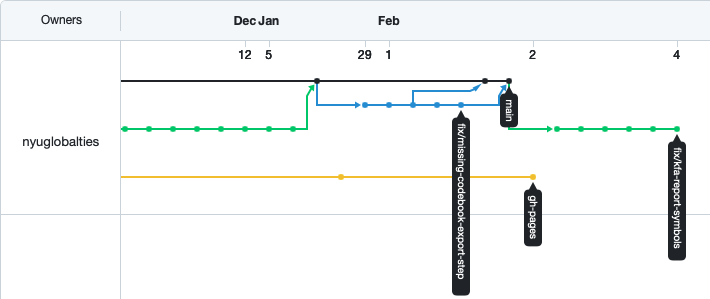

class: center, inverse, middle, title-slide

# Let's Write a Paper!

## Part I - Introduction

### Patrick Anker

.ties-footer[


]

---
class: middle, center

## Before we begin...

If you'd like to download any of the materials for this presentation, check out

**>> [the workshop's website](`r params$home`) <<**

### `r "\U1F680"`

---
class: middle, center, inverse

# Motivation

## `r "\U1F914"`

---

# Have you ever had this problem?

```
folder/
  report_final.docx
  report_final_CTD.docx
  report_final_v2.docx
  report_final_v2-approved_CTD.docx
  report_final_v3_20211110.docx
  report_final_v3-20211110_approved-for-real.docx
```

.center[

# `r "\U1F629"`

]

Too often we get trapped in the "final_final_v#" problem when collaborating that .red[we don't know which file is the _actual_ final one].

**This is where version control comes in.**

---

.definition[

## Version Control Systems

> a class of systems responsible for managing changes to computer programs, documents, large web sites, or other collections of information.

]

.pull-left[

**.red[Box]** implements a **centralized scheme**: there is only .red[one source of truth] and .red[one history for each file]. 

When working on your own with one file, this is generally okay, but when you start collaborating on the same file, you might end up with the situation on the right.

]

.pull-right.font12[

```
# on Box

folder/
  document.docx
  document (some.person@email.com).docx
```

]

---
class: middle, center

# Wouldn't it be nice if we could just have
# .red[one file]?

---
class: middle, center, inverse

# Enter

## .yellow[git] & .yellow[GitHub]

---

# What are .red[git] & .red[GitHub]?

.pull-left.definition[

## git

> A _decentralized_ version control system designed with collaboration in mind, allowing for projects to have multiple histories.

]

.pull-right.definition[

## GitHub

> A web service that acts as a git project host, project management suite, and web host<sup>1</sup>.

]

<br />

You could work entirely with git and never use GitHub, and vice versa. There are many git project hosts out there ([**GitLab**](https://about.gitlab.com/), [**Bitbucket**](https://bitbucket.org/), and more); we will focus on GitHub because it is _incredibly_ popular and user-friendly.

.footnote.font10[

<sup>1</sup>These slides are hosted on GitHub!

]

---
class: center, middle

# We'll first start with a tour of [.red[GitHub]](https://github.com)

???

Show dashboard view of GitHub, and then point to the "Repositories" list. At that point, move to next slide to show "Repository" definition.

---
class: middle

.definition[

## Repository (_"repo"_)

> A git project

]

---
class: center, middle

# Back to the tour...

???

- Show example repository (dt-handbook)
- Highlight commits

---
class: middle

.definition[

## Commit

> A snapshot of your repository's history. The entire history of commits is called the **commit log**.

]

--

.definition[

## Diff

> A comparison of two commits -- showing the linewise changes between them.

]

???

- Step back through commit log to show different state
- Show diff and reveal next part of slide 
- Show that the most recent commit is in the file link

---
class: middle, center

# Continuing...

???

- Show nyuglobalties org page
- Show blueprintr and begin discussion of branches

---

# Branching

Branching is **the** core component that makes a git project "distributed". 

.pull-left[

- Each branch contains its own history
- Branches can be spawned from any parent branch
- Branches can be **merged** into each other to combine histories (necessary for collaboration!)

]

.pull-right[



]

Branches can either be **local** (on your machine) or **remote** (on someone else's machine). 

**.red[There is no inherent "central" branch]**, but often those are created out of convention.

---
class: middle, center

# Let's create a project!

???

- Create new repo "git workshop paper" in "nyuglobalties" and show the autocomplete to hyphens; add README
- Add "This is our **collaborative** paper repo!" as a commit. Demonstrate Markdown syntax.
- Fork to `psanker`

---
class: middle

.definition[

## Fork

A process that copies an entire Github project from account `A` to account `B`. Often used in open-source software development setups.

]

---
class: inverse, center, middle

# Collaboration Time!

## Let's all make .yellow[forks] of the .yellow["nyuglobalties/git-workshop-paper"] project

???

Help people with forking

---

# Workflow Tips

In a collaborative setting, people generally .red[create new branches] for their own work .red[whenever they change things]. This applies to your own forks as well. We'll talk about branch naming conventions later.

**For now, I will create a branch for my new changes**.

???

- Create a new branch called "new-section-patrick"
- Add a new section, like, "`# Patrick's section`" with some flavor text.

---
class: middle, center, inverse

# Collaboration Time!

## Create your own sections on .yellow[your own branches] on .yellow[your new forks]!

---

# Merging & Pull Requests

Now that we have work on our own branches and forks, **how do we get it back into the main project?**

This is where **.red[Pull Requests]** come in.

.definition[

# Pull Request

A feature on Github that signals your intention to **merge** two branches (generally your own branch into some "main" branch). It provides a conversation interface to discuss your changes with other reviewers, request changes, even test code prior to merging.

]

???

- Create PR from my branch to main repo
- Walk through interface
- Provide review, request changes
- Submit new changes, talk about how PRs don't need to be reopened for each commit
- Merge PR

---
class: middle, center, inverse

# Collaboration Time!

## Create your own .yellow[pull requests] to the .yellow['main' branch] on the .yellow[TIES repository]!