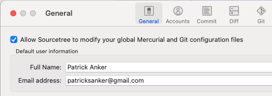
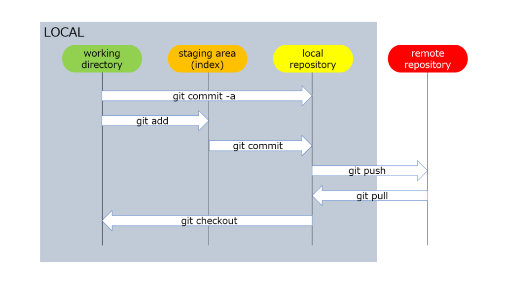

class: center, inverse, middle, title-slide

# Let's Write a Paper!

## Part II - git

### Patrick Anker

.ties-footer[


]

---
class: middle, center

## Before we begin...

If you'd like to download any of the materials for this presentation, check out

**>> [the workshop's website](`r params$home`) <<**

### `r "\U1F680"`

---
class: middle

# Recap

1. Introduction to git and Github software and their distinction
1. Overview of Github platform and its use
1. Overview of some basic git (and Github) terminology
    1. Repositories ("repos")
    1. Commits
    1. Branches
    1. Merges
    1. Pull Requests

---
class: middle

# Agenda

1. Intro to using a terminal
1. Using git in the terminal and with SourceTree

---
class: middle, center, inverse

# Using a terminal

## `r "\U1F5A5"`

---

# Moving Around

Learning how to use a terminal shell is a whole workshop series on its own. I just want to showcase **basic file system operations**.

- **`cd <dir>`**: Move to another folder ("Change directory")
- **`pwd`**: show where you are currently located -- your _working directory_ ("Print working directory")
- **`ls [-l, -a] [dir]`**: List the contents of your working directory _or_ of some other directory `dir`
- **`cat <file>`**: Print the contents of a file to your terminal screen
- **`mkdir [-p] <dir>`**: Creates a folder with path `dir` (`-p` signals if you'd like to recursively create folders if `dir` has multiple missing folders)
- **`rm [-r, -f] <path>`**: Removes a `path` (recursively with `-r`)
- **`mv <from> <to>`**: Move/rename a file/folder at `from` to `to`

These seven commands will cover most of what you need to do outside of `git` in most cases.

---
class: middle, center

# Loading up Terminal...

???

- Discuss how this is what a shell looks like on Mac and other UNIX-likes; for Windows, recommend the WSL or Git Bash
- List the contents of ~ with just `cd` and `cd ~`
- List with `ls -l` and `ls -la`; talk about `.` and `..`
- Move around with `cd`; showcase utility of `cd ..` and `cd -` with `pwd` and TAB COMPLETION and dragging folders from Finder to a `cd` command
- Go back to ~, create a folder, delete it
- Create ~/worksapce and rename to ~/workspace with `mv`
- `cd ~/workspace`

---
class: middle, inverse, center

# Onto git...

---

# Working Locally

Using Github as an editor is _okay_ if you're doing quick fixes, e.g. documentation improvements that just need a couple word changes. The downsides to working exclusively with Github are that:

1. You have to have an internet connection at all times
1. You cannot use any of the tools that you have on your computer

This is clearly not ideal when you're writing papers and may need to regenerate figures, tables, etc.

This is where **`git`** comes in. **.red[`git` is what you work with on _your_ computer].** 

By default, `git` is a command line tool. However, I'll be showing you how to work with the command line interface _and_ an application called "SourceTree" that makes it easier to visualize what's going on.

---

# Setting Up Your Local Git

There isn't too much you need to do before having your computer ready to go. However, you **do** need to tell git who you are. This is how git logs your commits and tells everyone who did what.

I'm going to show you how it's done with SourceTree:



**.red[VERY IMPORTANT]**: The email used for your git configuration **must** be the same as the one you used to register for Github.

---

# Setting Up Your Local Git

Of course, it is also possible to set these through the command line with

```sh
git config --global user.name "Your Name"
git config --global user.email "your@email.com"
```

You can also view your entire git configuration with

```sh
git config --list
```

Also, I **highly** recommend setting your default branch name to "main" with

```sh
git config --global init.defaultBranch "main"
```

You need to have at least `git 2.28` for that to take effect. Check `git --version` to confirm.

---

# Getting Your Work from Github

The first step is to **clone** your Github repository to your computer.

.definition[

# Cloning

Downloads a fresh copy of a repository to your computer from some remote (in our case, Github).

]

We achieve this with

```sh
git clone <url of remote repository>
```

or, using SourceTree, by using "New... > Clone from URL"

---

# Cloning

I'm now going to clone my fork of our paper's repository to my computer!

???

- Show how to clone with shell
- Show how to clone with SourceTree

---

# Overview of how git tracks changes



---

# Checking on the state of your repo

In order to know what things are in progress, there is the 

```sh
git status
```

command on the command line.

SourceTree's `git status` is essentially the "File status" view in "Workspace".

---
class: inverse, middle, center

# Adding some work...

???

- Add an "Abstract" section into the paper markdown file
- Show git status in command line
- Show git status in SourceTree
- Add an example NEW file and show "untracked"

---

## Now that I've made changes, how do I add them to git?

.pull-left[


]

.pull-right[

Referring back to this diagram, this is where we'd use

```sh
git add <file>
```

In SourceTree, all we need to do is check the file into the "Staged files" area.

**`git add` only moves files to staging.** The next step is to **commit** the file.

]

---

## Now that I've made changes, how do I add them to git?

.pull-left[


]

.pull-right.font12[

Once we're satisfied with all of our changes in staging, the last step we need to do is commit our work to the repository's history. We achieve this with

```sh
git commit -m <message>
```

In SourceTree, this is achieved by just filling out the "Commit message" field and clicking "Commit".

**NOTE**: If you use the command line, **remember to include the `-m`**! If you forget it, you may be dumped into a editor called "vim". Unless you are familiar with vim keybindings (a great skill to learn by the way), remember this command:

```vimscript
:q!
```

That'll get you out of vim so you can try again!

]

---

# A Quick Note About Committing Workflow

While the command line interface is more useful for me when it comes to dealing with branching and debugging, **I tend to use a GUI like SourceTree when committing work.**

This is because most git GUI tools have multiple views when it comes to staging and committing work: the staging view _and_ the file diff view. The command line interface doesn't do the file diff view during `git add` or `git commit` -- it only indicates that a file had been changed.

As is often the case, use the proper tool for the job for you!

???

- When transitioning to next slide, say "speaking of file diffing..."

---

## What kinds of files can I commit to git?

In principle, this could be answered by "any." In practice, however, you should only commit **plain text files**.

.pull-left.font12[

### Why?

Under the hood, git works by examining file differences and then storing those differences in a "blob" (like a ZIP file) -- primarily for saving space since the entire git history is stored locally in the ".git" folder.

In order for files to take advantage of these savings, they must be "diffable." Non-plain text files ("binary" files) are often not diffable because their data are not represented with text. **This means things like ZIP files, DTA files, and XLS & XLSX files are not recommended to be versioned with git**.

Want to know if a file is a binary? Look at it on the command line with `cat <file>`!

]

.pull-right.font12[

### What about Word documents?

Unfortunately, Word documents are actually binary files. Under the hood, DOCX and XLSX files are collections of XML files (which _are_ versionable with git since they are plain text) and folders that have been ZIP'd together. The file compression process makes MS Office files not versionable with git.

]