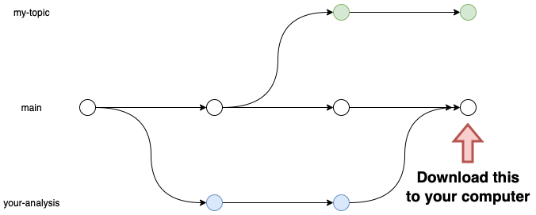

class: center, inverse, middle, title-slide

# Let's Write a Paper!

## Part III - Collaboration & Workflow Styles

### Patrick Anker

.ties-footer[


]

---
class: middle, center

## Before we begin...

If you'd like to download any of the materials for this presentation, check out

**>> [the workshop's website](`r params$home`) <<**

### `r "\U1F680"`

---

# Agenda

.pull-left[

So far, we have covered

- Introduction to GitHub & git
- How to create repos
- How to manage changes with commits and branches
- How get changes from and send changes to Github with `git pull` and `git push`

]

.pull-right[

Today, I want to cover:

1. How to merge work from other branches
1. Different collaboration styles
1. Issue tracking & commit conventions

]

---
class: middle, center, inverse

<script src="https://kit.fontawesome.com/8dd08732ee.js" crossorigin="anonymous"></script>

# Merging

## .yellow[<i class="fa fa-code-pull-request"></i>]

---

# Merging

Collaboration is only useful if we are able to combine our work on our different branches. We achieve this using a git **merge**

.definition[

## Merge

A mechanism that takes two (or more) histories and reconciles the differences in a line-wise fashion.

]

We've already used a mechanism that implements a merge before, and that's the **Pull Request** feature on Github! However, Pull Requests are really some nice window dressing around merges, and sometimes it's useful to merge work _outside_ of the context of a Pull Request.

---

# Merging

Consider this example:

.pull-left[

I'm working on a particular section of a report, and things are going swimmingly. However, I noticed that something in your analysis would be very nice to include in my report, but your analysis work was already merged into `main` via a Pull Request. 

How can I get your analysis work into my branch so I can make the changes in my report prior to creating a PR?

]

.pull-right[


]

---

# Merging

.center[]

.center[**.red[with a merge commit!]**]

---

# Merging

.center[]

.center[Github also makes a merge commit once a Pull Request is merged.]

---

# Merging

To perform this kind of merge, all you need to do is follow these steps:

.pull-left.font12[

Action | Example
:------|:--------
1. Switch to the branch you'd like to merge in | `git checkout main`

]

.pull-right[


]

---

# Merging

To perform this kind of merge, all you need to do is follow these steps:

.pull-left.font12[

Action | Example
:------|:--------
1. Switch to the branch you'd like to merge in | `git checkout main`
2. Download changes to your computer | `git pull`

]

.pull-right[



]

---

# Merging

To perform this kind of merge, all you need to do is follow these steps:

.pull-left.font12[

Action | Example
:------|:--------
1. Switch to the branch you'd like to merge in | `git checkout main`
2. Download changes to your computer | `git pull`
3. Switch back to your branch | `git checkout -`

]

.pull-right[


]

.footnote.font12[

The `-` is a shortcut for "previous branch". It's just like `cd -` from moving around th Terminal!

]

---

# Merging

To perform this kind of merge, all you need to do is follow these steps:

.pull-left.font12[

Action | Example
:------|:--------
1. Switch to the branch you'd like to merge in | `git checkout main`
2. Download changes to your computer | `git pull`
3. Switch back to your branch | `git checkout -`
4. Merge in the changes! | `git merge main`

]

.pull-right[


]

---

# Merging

These steps are the same for command line and for SourceTree:

1. Switch to the branch you'd like to merge in
1. Download changes to your computer, if they don't already exist
1. Switch back to your branch
1. Merge in the changes

.pull-left[

### Command Line 

.font12[

1. `git checkout <target branch>`
1. `git pull`
1. `git checkout -`
1. `git merge <target branch>`

]

.font10[

Note: After running `git merge` you may be thrown into an editor called "vim". Just remember this keystroke sequence and all will be well: `:wq<Enter>`

]

]

.pull-right.font12[

### SourceTree

1. Double-click on the target branch you'd like to merge in
1. Click "Pull"
1. Double-click on the branch you're working on
1. Click "Merge" and then select the commit that has the target branch's name tagged to it

]

???

- Pause for questions before moving on

---
class: middle

# The Golden Rule of Merging

> .red[Merge] to bring **someone else's** work **into your** branch; .red[Pull Request] to send **your** work **into someone else's** branch

Adhering to this rule will handle much of complexity and confusion that git can cause. This also creates a great social contract for you and your collaborators: adapt from others to create something new for yourself, ask permission to give back to others.

???

- Moving onto merge conflicts after this, so ask for any questions about merging in general

---
class: middle, center, inverse

# Merge Conflicts

## .yellow[<i class="fa fa-code-pull-request"></i>] `r "\U1F645"` `r "\U1F62B"`

---

# Merge Conflicts

Even with the best workflow, you will encounter merge conflicts. **And that is okay!** Embrace the merge conflicts. Accept them.

.center[

## .red[<i class="fa fa-spa"></i>]

]

In all seriousness, it is expected that you will encounter merge conflicts if you and your collaborator happen to edit **the same line**. 

.pull-left[

Unlike Box, however, git will tell you where the conflicts arise and guide you on how to resolve them. When you merge something that generates a conflict, you will see this:

]

.pull-right[

```
>>>>>>> your-current-branch
text that was in your branch
...
=======
text that was in the other branch
...
<<<<<<< branch-youre-merging-in
```

]

---

# Merge Conflicts

.pull-left[

The merge conflict chunks come in three parts:

1. `>>>>>>> [where you are, often "HEAD"]` followed by the content in your branch
1. `=======` - a partition between the two content areas
1. The content from the branch/commit you're merging in followed by `<<<<<<< [what you're merging in]`

]

.pull-right[
```
*>>>>>>> your-current-branch
text that was in your branch
...
*=======
text that was in the other branch
...
*<<<<<<< branch-youre-merging-in
```
]

---

# Merge Conflicts

.pull-left[

All you need to do is: 

1. Pick the content you want to keep between the two (could be a combination of both!)
1. **Delete** the lines with `<<<<<<<`, `>>>>>>>`, and `=======`.
1. Commit the changes!

]

.pull-right[

```
>>>>>>> your-current-branch
*text that was in your branch
*...
=======
*text that was in the other branch
*...
<<<<<<< branch-youre-merging-in
```

]